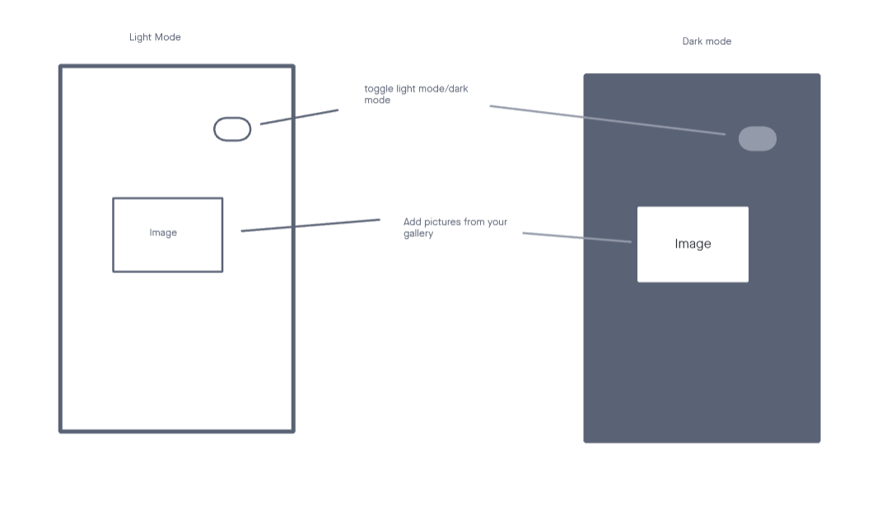

# Native React App

## Overview

A React Native frontend for mobile application that would allow user to make a carousel of images from their phone. Also features the option to toggle to a dark screen. An introduction to React Native.

## Deployment

How do I install the app or library? 
Clone this app and install all dependencies. 
 

For Applications: 
How do I run the app? 
You can run the app on your local terminal or through you phone via expo go. 
How do I set up the app? 
Be sure to install all dependencies. 

## Testing

No tests written
<!-- Run [nmp test] to run the tests.
- Tests that User should be able to send a request. -->

## Documentation

UML 

